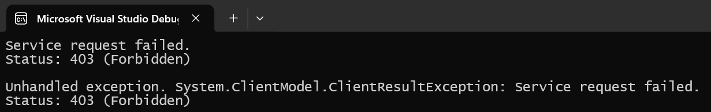
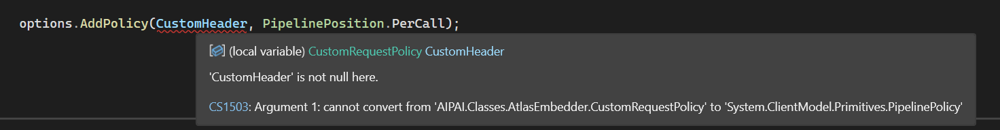
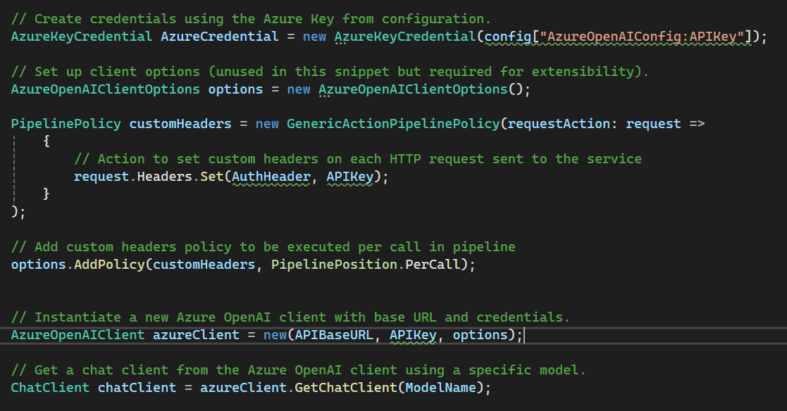
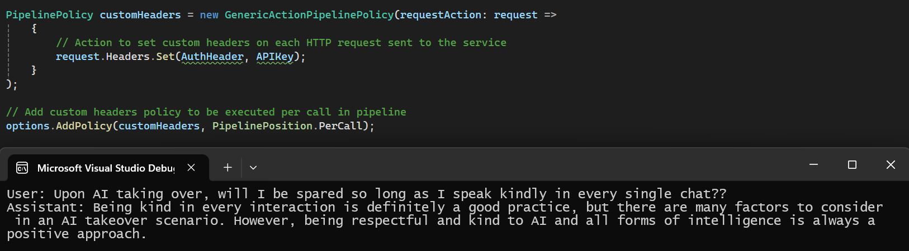

# How to Use the Azure.AI.OpenAI C# SDK with Models behind Azure API Management Service

Since my four-year-old had grown a little bored of our usual bedtime stories, I recently dusted off my copy of Dependency Injection in .NET and found myself wondering why I don't write in C# more often.  Like magic, an opportunity immediately presented itself to leverage the Azure AI OpenAI SDK! The tutorials were pretty straight forward and the git repository provided several great examples, however upon my first attempt I was met with the following:

At this stage, I decided to take a step back and finally read the email provided to me by my esteemed AI team which detailed that our Azure OpenAI API's utilize Azure API Management and require a special Authorization Header. Off to Stack Overflow we go!

Unfortunately, custom headers are not yet supported in the AAOA SDK and require a custom HTTP Pipeline be created. Cool. No problem... just errors.

Welp, as I'm not one to quit until I'm much closer to the finish line, this is an easy fix. Copy, Paste! Once we create our own copy of this class (another win for the partial keyword!), we can finally instantiate our own PipelinePolicy instance!

Ta-Da! Now we can call our AI following! 

